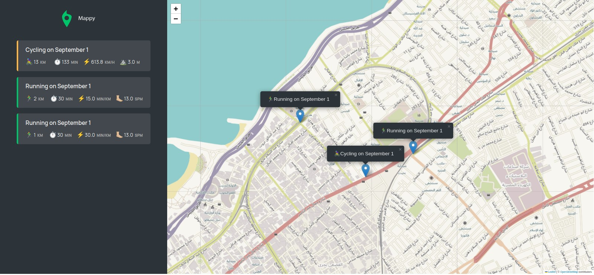

# 
Tool for monitoring your jogging and biking paths and showcasing them on a map based on their respective positions. The application is developed utilizing HTML, CSS, and JavaScript. It taps into the Geolocation API for accessing the user's present location and leverages the Mapbox API for rendering the map display. Additionally, the application takes advantage of the Local Storage API to retain user information directly within the web browser.

Users have the ability to interactively insert, revise, or remove jogging and biking events via the map interface.

# 
